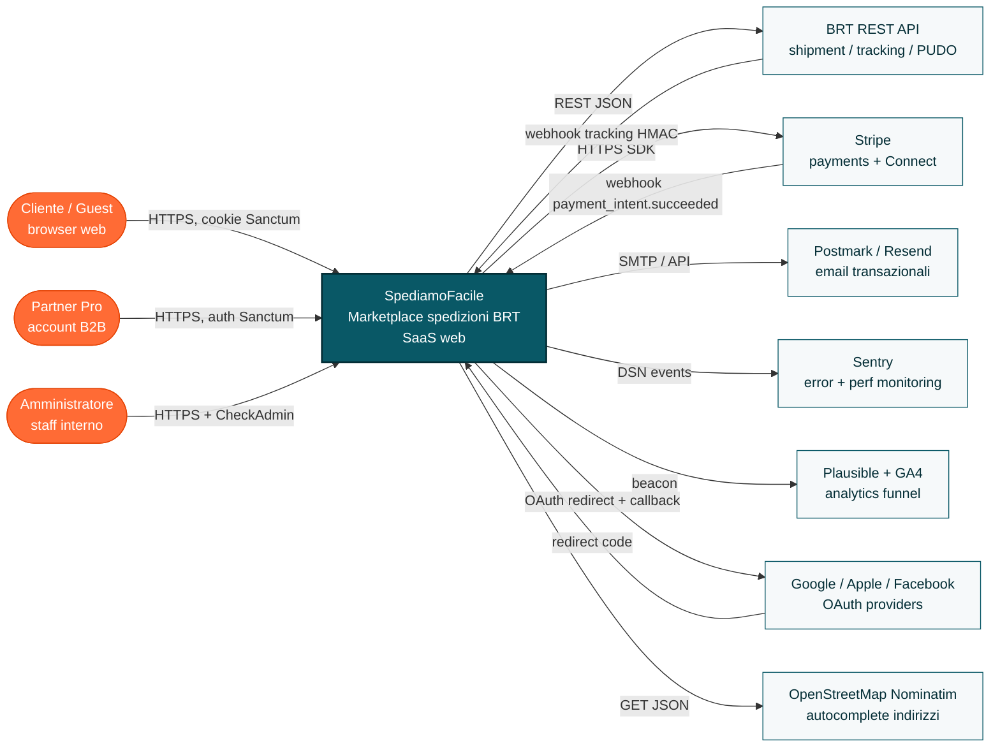
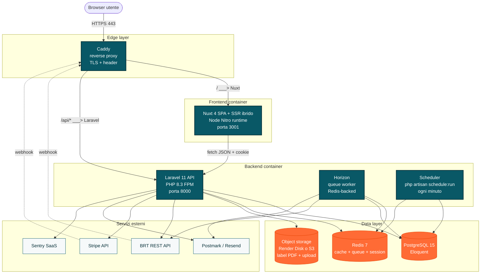
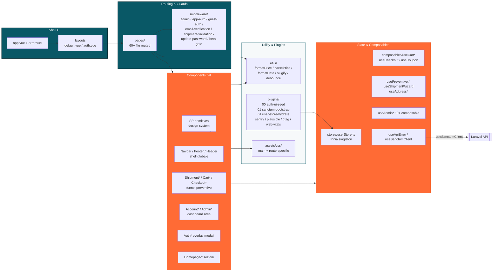
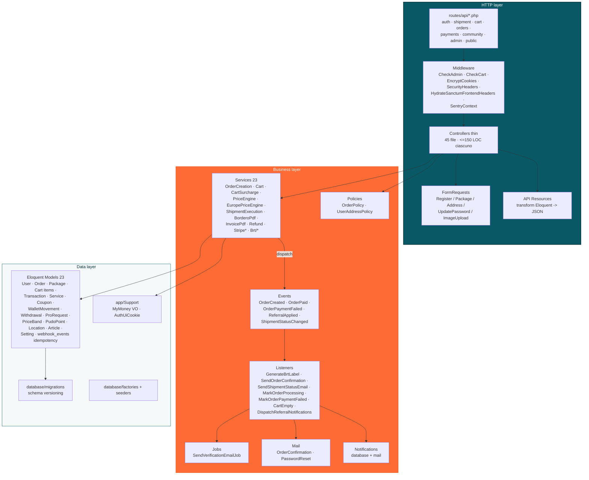
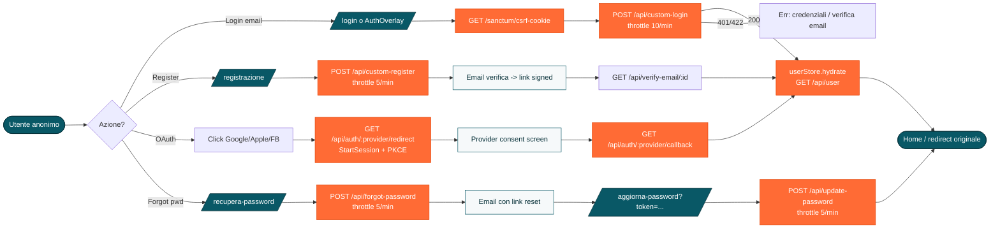
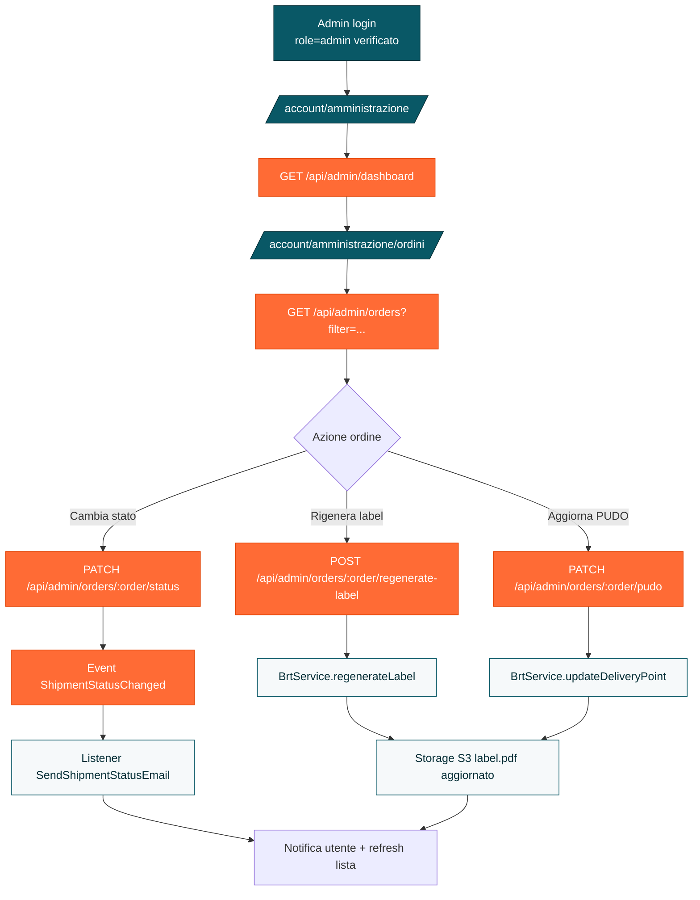
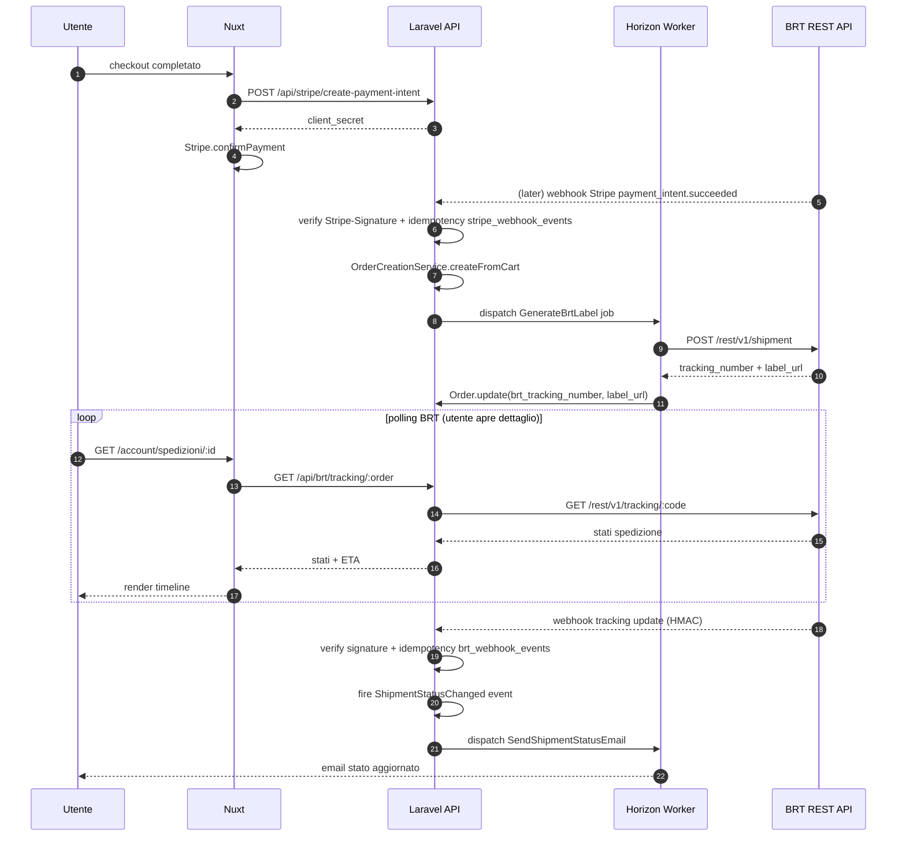
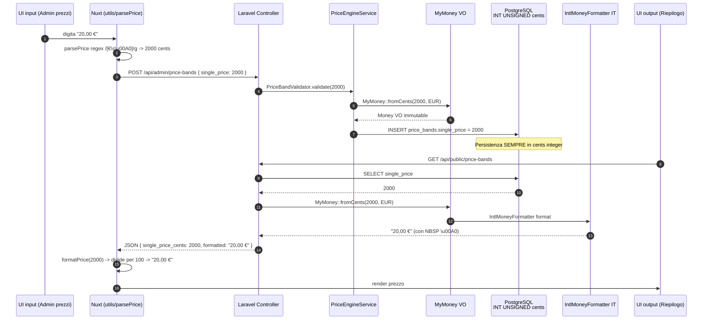

# Architecture Map — SpediamoFacile

> Mappa architetturale completa del progetto SpediamoFacile (Nuxt 3 + Laravel 11).
> Target: dev junior che vuole orientarsi in 30 minuti sul sistema end-to-end.
> Ultima revisione: 2026-04-18.

**Stack sintetico**: Nuxt 4.1 (Vue 3.5) + Nuxt UI 4 + Pinia 3 · Laravel 11 + Sanctum (Horizon NON installato — queue:work standard) · PostgreSQL 15 + Redis 7 · Stripe + BRT REST API · Sentry + Plausible · Caddy reverse proxy + Render.com.

**Palette progetto** (vincolante): teal primary `#095866`, orange accent `#E44203`, neutri grigi. MAI blu/indigo/sky/slate nei diagrammi.

**Indice**:

1. [Contesto C4 (attori esterni)](#1-contesto-c4)
2. [Container C4 (deployable)](#2-container-c4)
3. [Component C4 — Frontend Nuxt](#3-component-c4--frontend)
4. [Component C4 — Backend Laravel](#4-component-c4--backend)
5. [Sitemap completa](#5-sitemap-completa)
6. [UX Flow principali](#6-ux-flow-principali)
7. [Data flow prezzi (moneyphp cents)](#7-data-flow-prezzi-moneyphp-cents)
8. [API contract mapping](#8-api-contract-mapping)
9. [Dipendenze critiche](#9-dipendenze-critiche)
10. [Architettura sicurezza](#10-architettura-sicurezza)
11. [Punti di attenzione rilevati](#11-punti-di-attenzione-rilevati)

---

## 1. Contesto C4

Livello 1 C4: SpediamoFacile come box centrale, attori esterni tutt'intorno.



**Note**:
- Il cliente guest può creare preventivo senza login, ma per pagare serve account.
- Tutte le spedizioni passano dall'account BRT Business unico (intermediario diretto, vedi ADR 003).
- I webhook esterni (Stripe, BRT) sono idempotenti via tabelle dedicate `stripe_webhook_events` / `brt_webhook_events`.

---

## 2. Container C4

Livello 2 C4: deployable units e relazioni.



**Deploy Render.com**:
- Web service Node (Nuxt build + Nitro server).
- Web service PHP (Laravel Octane / FPM dietro Caddy).
- Worker service (Horizon queue).
- Cron service (scheduler Laravel).
- Managed Postgres + Managed Redis.

---

## 3. Component C4 — Frontend

Livello 3 C4 per `nuxt-spedizionefacile-master/`. Raggruppamento per responsabilità.



**Regole chiave**:
- `userStore` è l'UNICO store Pinia globale (user + hydration). Tutto il resto passa per composable + `useState()`.
- `useSanctumClient()` è l'unico canale per chiamate API (autogestisce CSRF). Vietato `$fetch` raw.
- Un composable = uno stato. Nessuna duplicazione cross-componente.
- CSS globali in `assets/css/main.css`; gli altri sono route-specific importati nelle page (code-split Vite).

---

## 4. Component C4 — Backend

Livello 3 C4 per `laravel-spedizionefacile-main/app/`.



**Convenzioni**:
- Controller sempre thin: validate (FormRequest) -> authorize (Policy) -> delegate (Service) -> return JSON Resource.
- Nessun Eloquent query in Controller. Nessun HTTP in Service.
- Transazioni DB orchestrate in Service con `DB::transaction()`.
- Eventi di dominio (OrderPaid, OrderCreated) disaccoppiano pricing da lato BRT/email.
- `MyMoney` (wrapper moneyphp/money) unico punto di creazione/somma/format prezzi.

---

## 5. Sitemap completa

Totale file in `nuxt-spedizionefacile-master/pages/`: **63 file** (uno catch-all + index + sub-route). Sono elencati tutti qui di seguito con scope (pubblico / autenticato / admin / sviluppo).

```text
pages/
├── index.vue                              [P]   Homepage con hero + preventivo inline
├── [...slug].vue                          [P]   Catch-all per pagine CMS legacy (fallback)
├── preventivo.vue                         [P]   Funnel step 1: peso/dim/tratta
├── la-tua-spedizione/
│   └── [step].vue                         [P]   Funnel step 2-3 dinamico (servizi, indirizzi)
├── riepilogo.vue                          [P]   Funnel step 4: riepilogo pre-checkout
├── carrello.vue                           [P*]  Carrello (guest o auth)
├── checkout.vue                           [A*]  Pagamento Stripe Elements
│
├── autenticazione.vue                     [G]   Overlay auth generico (login/register)
├── login.vue                              [G]   Login dedicato
├── registrazione.vue                      [G]   Registrazione dedicata
├── recupera-password.vue                  [G]   Forgot password
├── aggiorna-password.vue                  [G]   Reset password (link email)
├── verifica-email.vue                     [G]   Landing verifica link email
├── beta-invite.vue                        [P]   Gate beta (soft-launch privato)
│
├── chi-siamo.vue                          [P]   Pagina istituzionale
├── contatti.vue                           [P]   Form contatti (throttle 5/min)
├── faq.vue                                [P]   FAQ pubblica
├── reclami.vue                            [P]   Modulo reclami
├── termini-condizioni.vue                 [P]   Legal
├── privacy-policy.vue                     [P]   Legal GDPR
├── cookie-policy.vue                      [P]   Legal cookie
├── traccia-spedizione.vue                 [P]   Tracking pubblico (input codice)
│
├── blog/
│   ├── index.vue                          [P]   Lista blog
│   └── [slug].vue                         [P]   Articolo blog
├── guide/
│   ├── index.vue                          [P]   Lista guide
│   └── [slug].vue                         [P]   Guida singola
├── servizi/
│   ├── index.vue                          [P]   Lista servizi
│   ├── [slug].vue                         [P]   Servizio singolo (CMS)
│   └── pagamento-alla-consegna.vue        [P]   Landing servizio COD
│
├── account.vue                            [A]   Shell account wrapper (layout)
├── account/
│   ├── index.vue                          [A]   Dashboard cliente KPI
│   ├── account-pro.vue                    [A]   Area Partner Pro
│   ├── assistenza.vue                     [A]   Supporto + ticket
│   ├── bonus.vue                          [A]   Bonus referral / crediti
│   ├── carte.vue                          [A]   Carte salvate Stripe setup-intent
│   ├── indirizzi/index.vue                [A]   Rubrica indirizzi
│   ├── notifiche.vue                      [A]   Inbox notifiche
│   ├── portafoglio.vue                    [A]   Saldo wallet + top-up
│   ├── prelievi.vue                       [A]   Richieste prelievo (Pro)
│   ├── profilo.vue                        [A]   Dati anagrafici + password
│   ├── spedizioni/
│   │   ├── index.vue                      [A]   Lista ordini utente
│   │   └── [id].vue                       [A]   Dettaglio ordine + tracking + invoice
│   └── spedizioni-configurate.vue         [A]   Saved shipments riutilizzabili
│
├── account/amministrazione/
│   ├── index.vue                          [X]   Admin home / KPI
│   ├── ordini.vue                         [X]   Lista + status + regen-label
│   ├── spedizioni.vue                     [X]   Spedizioni + pickup + bordero
│   ├── utenti.vue                         [X]   Gestione utenti (role/approve/delete)
│   ├── prezzi.vue                         [X]   Fasce prezzo bulk edit
│   ├── coupon.vue                         [X]   CRUD coupon
│   ├── portafogli.vue                     [X]   Overview wallet utenti
│   ├── prelievi.vue                       [X]   Approve/reject withdrawal
│   ├── referral.vue                       [X]   Statistiche referral
│   ├── messaggi.vue                       [X]   Contact messages inbox
│   ├── impostazioni.vue                   [X]   Settings Stripe + globali
│   ├── immagine-homepage.vue              [X]   Upload hero image
│   ├── test-brt.vue                       [D]   Dev-only sandbox BRT
│   ├── blog/
│   │   ├── index.vue                      [X]   Lista articoli blog
│   │   ├── nuovo.vue                      [X]   Crea nuovo articolo
│   │   └── [id].vue                       [X]   Edit articolo
│   ├── guide/
│   │   ├── index.vue                      [X]   Lista guide
│   │   ├── nuovo.vue                      [X]   Crea guida
│   │   └── [id].vue                       [X]   Edit guida
│   └── servizi/
│       ├── index.vue                      [X]   Lista servizi CMS
│       ├── nuovo.vue                      [X]   Crea servizio
│       └── [id].vue                       [X]   Edit servizio
│
└── preview/
    └── home-hero.vue                      [D]   Preview isolata hero (dev-only)
```

**Legenda scope**:
- `[P]` Pubblica (no login)
- `[P*]` Pubblica ma context-sensitive (guest/auth ramo diverso)
- `[G]` Guest-only (redirect se già loggato)
- `[A]` Auth required (middleware `app-auth`)
- `[A*]` Auth required soft (auth + cart + email verified)
- `[X]` Admin-only (middleware `admin.js` -> role=admin)
- `[D]` Dev-only (gate `enableDevTools` runtime, 404 in prod)

**Totale per scope**: 31 pubbliche, 6 guest-only, 14 auth cliente, 20 admin, 2 dev-only.

---

## 6. UX Flow principali

### 6.1 Flow Preventivo → Pagamento → Conferma

```mermaid
flowchart TD
    classDef state fill:#095866,stroke:#042e36,color:#ffffff
    classDef api fill:#ff6b35,stroke:#E44203,color:#ffffff
    classDef ext fill:#f6f9fa,stroke:#095866,color:#042e36

    A[Home / Preventivo<br/>input peso/dim/tratta] --> B[POST /api/session/first-step<br/>persist step 1]
    B --> C[/la-tua-spedizione/2<br/>servizi extra/]
    C --> D[POST /api/session/second-step<br/>persist step 2]
    D --> E[/la-tua-spedizione/3<br/>indirizzi + PUDO/]
    E --> F{Utente loggato?}
    F -- no --> G[Modal AuthOverlay<br/>login o register]
    F -- si --> H[Riepilogo + Carrello]
    G --> H
    H --> I[POST /api/cart<br/>persist pacco]
    I --> J[/carrello/]
    J --> K[/checkout/<br/>Stripe Elements]
    K --> L[POST /api/stripe/create-payment-intent]
    L --> M[confirmPayment<br/>Stripe.js]
    M --> N{3DS?}
    N -- si --> M
    N -- no --> O[Webhook payment_intent.succeeded]
    O --> P[OrderCreationService<br/>crea Order + Transaction]
    P --> Q[Dispatch GenerateBrtLabel listener]
    Q --> R[BrtService -> POST api.brt.it/shipment]
    R --> S[Order.brt_tracking_number salvato]
    S --> T[Email OrderConfirmation via Postmark]
    T --> U[/account/spedizioni/:id/]

    class A,C,E,H,J,K,U state
    class B,D,I,L,P api
    class M,O,R,T ext
```

### 6.2 Flow Autenticazione

Login / Register / OAuth / Forgot-password. Niente 2FA attualmente.



**2FA**: non implementato. Esiste solo `POST /api/auth/confirm-password` per re-conferma credenziali su azioni sensibili.

### 6.3 Flow Admin gestione ordini



### 6.4 Flow Tracking BRT post-pagamento



---

## 7. Data flow prezzi (moneyphp cents)

Convenzione ferrea (ADR 002): **backend salva cents (integer), frontend divide per 100 solo per display**.



**Anti-pattern da evitare**:
- `float` sui prezzi (errore floating point 0.1 + 0.2 ≠ 0.3).
- `.trim()` su stringhe formattate: non rimuove `\u00A0` NBSP. Usa sempre la regex.
- Salvare `DECIMAL(10,2)` nel DB: sempre `INT UNSIGNED` cents.
- Moltiplicare prezzi in Controller: delegare a `MyMoney::multiply()` / `CartService`.

---

## 8. API contract mapping

Tutti gli endpoint `/api/*`, raggruppati. Totale **~110 endpoint attivi** tra public, auth, admin, webhook.

### 8.1 Auth & user (13)

| Metodo | Endpoint | Scope | Scopo |
|---|---|---|---|
| GET | `/api/user` | auth | Utente corrente |
| POST | `/api/custom-login` | public, throttle 10/min | Login email+password |
| POST | `/api/custom-register` | public, throttle 5/min | Registrazione nuovo utente |
| POST | `/api/logout` | auth | Logout + revoca token |
| POST | `/api/forgot-password` | public, throttle 5/min | Invia link reset |
| POST | `/api/update-password` | public, throttle 5/min | Reset password finale |
| GET | `/api/verify-email/{id}` | signed | Verifica email link |
| POST | `/api/resend-verification-email` | public, throttle 5/min | Re-invia verifica |
| POST | `/api/verify-code` | public, throttle 5/min | Verifica codice OTP |
| GET | `/api/auth/providers` | public | Provider OAuth abilitati |
| GET | `/api/auth/{provider}/redirect` | public | Redirect OAuth (Google/Apple/FB) |
| GET | `/api/auth/{provider}/callback` | public | Callback OAuth |
| POST | `/api/auth/confirm-password` | auth | Re-conferma password |
| GET, PUT | `/api/users/{user}` | auth | Self-read/update profilo |

### 8.2 Sessione preventivo, location, PUDO, tracking (11)

| Metodo | Endpoint | Scope | Scopo |
|---|---|---|---|
| GET | `/api/session` | public | Contesto preventivo guest |
| POST | `/api/session/first-step` | public | Persist peso/dim/tratta |
| POST | `/api/session/second-step` | public | Persist servizi extra |
| GET | `/api/locations/search?q=` | public, throttle 30/min | Autocomplete CAP/città |
| GET | `/api/locations/by-cap` | public | Lookup CAP |
| GET | `/api/locations/by-city` | public | Lookup città |
| GET | `/api/brt/pudo/search` | public | Ricerca PUDO per CAP |
| GET | `/api/brt/pudo/nearby` | public | PUDO geolocalizzato |
| GET | `/api/brt/pudo/{id}` | public | Dettaglio PUDO |
| GET | `/api/tracking/search?code=` | public, throttle 15/min | Tracking pubblico codice |
| GET | `/api/brt/tracking/{order}` | auth | Tracking ordine loggato |

### 8.3 Cart, packages, addresses (17)

| Metodo | Endpoint | Scope | Scopo |
|---|---|---|---|
| GET, POST | `/api/guest-cart` | public | Carrello guest (session) |
| PUT, DELETE | `/api/guest-cart/{id}` | public | CRUD item guest |
| DELETE | `/api/empty-guest-cart` | public | Svuota guest cart |
| GET, POST | `/api/cart` | auth | Carrello utente (DB) |
| GET, PUT, DELETE | `/api/cart/{cart}` | auth | CRUD item user cart |
| PATCH | `/api/cart/{id}/quantity` | auth | Aggiorna quantità |
| POST | `/api/cart/merge` | auth | Merge guest -> user |
| DELETE | `/api/empty-cart` | auth | Svuota user cart |
| GET, POST, PUT, DELETE | `/api/packages` | auth | CRUD Package |
| GET, POST, PUT, DELETE | `/api/addresses` | auth | Indirizzi pacco |
| GET, POST, PUT, DELETE | `/api/user-addresses` | auth | Rubrica personale |

### 8.4 Coupon, saved shipments, orders, shipment execution (15)

| Metodo | Endpoint | Scope | Scopo |
|---|---|---|---|
| POST | `/api/calculate-coupon` | auth, throttle 5/min | Calcola sconto coupon |
| GET, POST, PUT, DELETE | `/api/saved-shipments` | auth | Saved shipments CRUD |
| POST | `/api/saved-shipments/add-to-cart` | auth | Duplica in carrello |
| GET | `/api/orders` | auth | Lista ordini utente |
| GET | `/api/orders/{order}` | auth | Dettaglio ordine |
| POST | `/api/orders/{order}/cancel` | auth, throttle 3/min | Annulla ordine |
| GET | `/api/orders/{order}/invoice` | auth | Download PDF fattura |
| GET | `/api/orders/{order}/refund-eligibility` | auth, throttle 5/min | Check rimborso |
| POST | `/api/orders/{order}/add-package` | auth, throttle 10/min | Aggiungi pacco |
| POST | `/api/create-direct-order` | auth, throttle 5/min | Ordine diretto (Partner) |
| GET | `/api/orders/{order}/execution` | auth | Stato esecuzione |
| POST | `/api/orders/{order}/pickup` | auth, throttle 5/min | Richiedi pickup BRT |
| POST | `/api/orders/{order}/bordero` | auth, throttle 5/min | Genera bordero |
| GET | `/api/orders/{order}/bordero/download` | auth | Download PDF bordero |
| POST | `/api/orders/{order}/send-documents` | auth, throttle 5/min | Invia documenti email |

### 8.5 BRT shipment management (5)

| Metodo | Endpoint | Scope | Scopo |
|---|---|---|---|
| POST | `/api/brt/create-shipment` | auth, throttle 5/min | Crea spedizione BRT |
| POST | `/api/brt/confirm-shipment` | auth, throttle 5/min | Conferma dopo verify |
| POST | `/api/brt/delete-shipment` | admin | Annulla spedizione |
| GET | `/api/brt/label/{order}` | auth | Download etichetta PDF |

### 8.6 Payments Stripe & wallet (17)

| Metodo | Endpoint | Scope | Scopo |
|---|---|---|---|
| POST | `/api/stripe/create-payment-intent` | auth + cart, throttle 10/min | Crea PI |
| POST | `/api/stripe/create-payment` | auth | Wrapper non-3DS |
| POST | `/api/stripe/create-order` | auth + cart | Order pending pre-pagamento |
| POST | `/api/stripe/order-paid` | auth + cart | Conferma client post-confirm |
| POST | `/api/stripe/existing-order-payment-intent` | auth | Retry ordine esistente |
| POST | `/api/stripe/existing-order-payment` | auth | Retry non-3DS |
| POST | `/api/stripe/existing-order-paid` | auth | Conferma retry |
| POST | `/api/stripe/mark-order-completed` | auth | Fallback webhook |
| POST | `/api/stripe/create-setup-intent` | auth, throttle 10/min | Aggiungi carta |
| GET | `/api/stripe/payment-methods` | auth | Lista carte salvate |
| GET | `/api/stripe/default-payment-method` | auth | Default carta |
| POST | `/api/stripe/set-default-payment-method` | auth | Set default |
| POST | `/api/stripe/change-default-payment-method` | auth | Cambia default |
| DELETE | `/api/stripe/delete-card` | auth, throttle 10/min | Rimuovi carta |
| GET | `/api/stripe/connect` | auth | Stripe Connect onboarding |
| GET | `/api/stripe/callback` | public | Connect callback |
| GET | `/api/stripe/create-account` | auth | Crea account Connect |
| GET, POST | `/api/settings/stripe` | auth/admin | Config Stripe dinamica |
| GET | `/api/wallet/balance` | auth | Saldo portafoglio |
| GET | `/api/wallet/movements` | auth | Storico movimenti |
| POST | `/api/wallet/top-up` | auth, throttle 5/min | Ricarica via Stripe |
| POST | `/api/wallet/pay` | auth, throttle 10/min | Paga ordine con wallet |

### 8.7 Referral, notifications, withdrawals, pro, contact (14)

| Metodo | Endpoint | Scope | Scopo |
|---|---|---|---|
| GET | `/api/referral/my-code` | auth | Codice invito |
| POST | `/api/referral/validate` | auth, throttle 10/min | Valida codice |
| POST | `/api/referral/apply` | auth, throttle 5/min | Applica a ordine |
| POST | `/api/referral/store` | auth, throttle 5/min | Persist signup |
| GET | `/api/referral/my-discount` | auth | Sconto attivo |
| GET | `/api/referral/earnings` | auth | Guadagni referral |
| GET | `/api/withdrawals` | auth | Storico prelievi |
| POST | `/api/withdrawals` | auth, throttle 3/min | Richiedi prelievo |
| GET | `/api/notifications` | auth | Lista notifiche |
| GET | `/api/notifications/unread-count` | auth | Contatore non lette |
| PATCH | `/api/notifications/{id}/read` | auth | Mark read |
| PATCH | `/api/notifications/read-all` | auth | Mark all read |
| GET, PUT | `/api/notifications/preferences` | auth | Preferenze canali |
| POST | `/api/pro-request` | auth, throttle 5/min | Upgrade Partner Pro |
| GET | `/api/pro-request/status` | auth | Stato richiesta |
| POST | `/api/contact` | public, throttle 5/min | Form contatti |
| POST | `/api/support-tickets` | auth, throttle 10/min | Ticket loggato |

### 8.8 Public content, GDPR, health (11)

| Metodo | Endpoint | Scope | Scopo |
|---|---|---|---|
| GET | `/api/public/blog` | public | Lista blog |
| GET | `/api/public/blog/{slug}` | public | Articolo blog |
| GET | `/api/public/guides` | public | Lista guide |
| GET | `/api/public/guides/{slug}` | public | Guida singola |
| GET | `/api/public/services` | public | Lista servizi |
| GET | `/api/public/services/{slug}` | public | Servizio singolo |
| GET | `/api/public/price-bands` | public | Fasce prezzo pubbliche |
| GET | `/api/public/homepage-image` | public | Hero image |
| DELETE | `/api/user/account` | auth | Cancella account GDPR |
| GET | `/api/user/data-export` | auth | Export dati GDPR art.20 |
| POST | `/api/cookie-consent` | public, throttle 10/min | Consent cookie |
| GET | `/api/health` | public, throttle 30/min | Readiness DB+Redis |
| GET | `/api/health/live` | public | Liveness ping |

### 8.9 Admin (29)

Tutte le rotte sotto `/api/admin/*` richiedono `auth:sanctum` + middleware `CheckAdmin`.

| Metodo | Endpoint | Scopo |
|---|---|---|
| GET | `/api/admin/dashboard` | KPI (ordini, revenue, utenti) |
| GET | `/api/admin/orders` | Lista ordini filtri |
| PATCH | `/api/admin/orders/{order}/status` | Cambia stato |
| PATCH | `/api/admin/orders/{order}/pudo` | Aggiorna PUDO |
| POST | `/api/admin/orders/{order}/regenerate-label` | Rigenera etichetta BRT |
| GET | `/api/admin/shipments` | Lista spedizioni |
| GET | `/api/admin/wallet/overview` | Overview wallet |
| GET | `/api/admin/wallet/users/{user}/movements` | Movimenti utente |
| GET | `/api/admin/withdrawals` | Lista prelievi |
| POST | `/api/admin/withdrawals/{id}/approve` | Approva |
| POST | `/api/admin/withdrawals/{id}/reject` | Rifiuta |
| GET | `/api/admin/referrals` | Stats referral |
| GET | `/api/admin/pro-requests` | Lista richieste Pro |
| PATCH | `/api/admin/pro-requests/{id}/approve` | Approva Pro |
| PATCH | `/api/admin/pro-requests/{id}/reject` | Rifiuta Pro |
| GET | `/api/admin/users` | Lista utenti |
| PATCH | `/api/admin/users/{id}/approve` | Approva |
| PATCH | `/api/admin/users/{id}/role` | Cambia ruolo |
| PATCH | `/api/admin/users/{id}/user-type` | Cambia tipo |
| DELETE | `/api/admin/users/{id}` | Elimina |
| GET | `/api/admin/contact-messages` | Inbox contatti |
| PATCH | `/api/admin/contact-messages/{id}/read` | Mark read |
| GET, POST | `/api/admin/settings` | Impostazioni globali |
| GET, POST | `/api/admin/articles` | Lista/crea articoli |
| GET, PUT, DELETE | `/api/admin/articles/{id}` | CRUD articolo |
| POST | `/api/admin/articles/{id}/upload-image` | Upload immagine (30/min) |
| GET, PUT | `/api/admin/price-bands` | Bulk edit fasce |
| POST | `/api/admin/price-bands/seed` | Seed iniziale |
| GET, POST | `/api/admin/promo-settings` | Settings promozioni |
| POST | `/api/admin/promo-settings/upload-image` | Upload promo (30/min) |
| GET, POST | `/api/admin/homepage-image` | Hero image CRUD |
| GET, POST, PUT, DELETE | `/api/admin/coupons` | CRUD coupon |
| POST | `/api/upload-file` | Upload file admin (30/min) |
| GET | `/api/get-admin-image` | Avatar admin |
| POST | `/api/admin/brt/test-create` | Sandbox BRT dev |

### 8.10 Webhook (2)

| Metodo | Endpoint | Scope | Scopo |
|---|---|---|---|
| POST | `/api/stripe/webhook` | public, signed | Stripe events (payment_intent, charge, etc.) |
| POST | `/webhooks/brt/tracking` | public, HMAC + IP whitelist | BRT tracking updates (rotta `routes/web.php`, NO prefix `/api`) |

**Convenzioni API**:
- Paginazione Laravel standard: `?page=`, `?per_page=` (default 15, max 100).
- Rate limiting: header `X-RateLimit-Limit`, 429 su sforamento.
- Errori: `{ "message", "errors": { field: [...] } }` (422 validation, 419 CSRF, 401 auth, 403 policy).
- Tutti i prezzi in centesimi EUR integer.

---

## 9. Dipendenze critiche

### 9.1 Frontend (`package.json`)

| Pacchetto | Versione | Ruolo |
|---|---|---|
| `nuxt` | 4.1 | Framework SSR/SPA ibrido |
| `vue` + `vue-router` | 3.5 | Core UI framework |
| `@nuxt/ui` | 4.x | Component library (theme teal/slate override) |
| `@nuxt/image` | - | Ottimizzazione AVIF+WebP |
| `@nuxt/fonts` | - | Font locali @fontsource |
| `@nuxtjs/sitemap` | - | Generazione sitemap.xml dinamica |
| `@pinia/nuxt` + `pinia` | 3 | Store globale `userStore` |
| `nuxt-auth-sanctum` | - | Client Sanctum cookie-based (CSRF auto) |
| `nuxt-security` | - | Header OWASP + CSP enforce |
| `@stripe/stripe-js` | 7 | Stripe Elements + confirmPayment |
| `@sentry/vue` | - | Error tracking + perf (no-op se DSN vuoto) |
| `web-vitals` | - | LCP/INP/CLS beacon |
| `@vue-leaflet/vue-leaflet` + `leaflet` | - | Mappa PUDO lazy-loaded |
| `@tiptap/*` | - | Editor rich text admin blog/guide (lazy) |
| `swiper` | - | Carousel homepage |
| `isomorphic-dompurify` | - | Sanitize HTML user content |
| `@fontsource/inter` + `montserrat` | - | Font self-hosted |
| `@iconify-json/mdi` | - | Icon set Material Design |

**Dev**: `@playwright/test`, `@axe-core/playwright` (a11y), `vitest` (unit), `vue-tsc` (typecheck), `eslint` flat config, `prettier`.

### 9.2 Backend (`composer.json`)

| Pacchetto | Versione | Ruolo |
|---|---|---|
| `laravel/framework` | 11 | Core PHP framework |
| `laravel/sanctum` | 4 | SPA cookie auth + API tokens |
| `laravel/fortify` | 1.25 | Feature auth (password reset primitives) |
| `laravel/socialite` | 5.23 | OAuth Google/Facebook/Apple |
| `laravel/tinker` | 2.9 | REPL dev |
| `moneyphp/money` | 4.7 | VO cents immutable, IntlFormatter |
| `stripe/stripe-php` | 18 | Stripe SDK (PaymentIntents, Connect, webhook) |

**Dev**: `phpstan/phpstan` + `larastan/larastan` (static analysis), `laravel/pint` (PHP-CS-Fixer), `phpunit/phpunit` 10.5, `mockery/mockery`, `fakerphp/faker`, `nunomaduro/collision`, `spatie/laravel-ignition`.

**Componenti runtime non in composer.json**:
- `predis/predis` o `phpredis` per Redis (driver)
- `guzzlehttp/guzzle` trasitivo via Stripe SDK per HTTP client BRT
- Sentry PHP SDK (installato via env oppure via `sentry/sentry-laravel` se presente)
- Horizon **NON installato** (verificato 2026-04-18: composer.json non lo include). Per dashboard queue monitoring si valuta `composer require laravel/horizon` come item di backlog post-MVP. Nel frattempo: queue:work standard + Sentry breadcrumbs + Render logs.

### 9.3 Infra

- **Caddy 2.x**: reverse proxy, TLS automatico, routing `/` → Nuxt, `/api/*` → Laravel.
- **PostgreSQL 15** (Render Managed).
- **Redis 7** (Render Managed): cache default, queue `default|emails|webhooks`, session store.
- **Render.com**: 4 servizi (web Nuxt, web Laravel, worker Horizon, cron scheduler).
- **Postmark / Resend**: mail transport transazionale.
- **Sentry SaaS**: DSN env-driven, sample rate 10% prod / 100% staging.

---

## 10. Architettura sicurezza

Strati a difesa in profondità.

```mermaid
flowchart TB
    classDef edge fill:#095866,stroke:#042e36,color:#ffffff,stroke-width:2px
    classDef mid fill:#ff6b35,stroke:#E44203,color:#ffffff
    classDef app fill:#f6f9fa,stroke:#095866,color:#042e36

    Browser([Browser utente]) --> L1

    subgraph L1[Edge - Caddy + nuxt-security]
        CSP[CSP header enforce<br/>script-src self + stripe + plausible<br/>NO unsafe-inline in prod]
        HSTS[HSTS + X-Frame-Options<br/>Permissions-Policy]
        TLS[TLS 1.3 automatico]
    end

    L1 --> L2

    subgraph L2[HTTP - Laravel middleware]
        Stateful[EnsureFrontendRequestsAreStateful]
        CSRFm[VerifyCsrfToken<br/>header X-XSRF-TOKEN == cookie]
        Sanctum[auth:sanctum guard<br/>cookie spediamofacile_session]
        Throttle[ThrottleRequests<br/>rate-limit per endpoint 3-30/min]
        CheckAdmin[CheckAdmin middleware<br/>role == admin]
        CheckCart[CheckCart middleware<br/>cart non vuoto]
        SecHdr[SecurityHeaders custom]
        SentryCtx[SentryContext enrichment]
    end

    L2 --> L3

    subgraph L3[Domain - Policies + FormRequests]
        FR[FormRequest validation<br/>mime, size, rules]
        Pol[Policies<br/>OrderPolicy owner-only<br/>UserAddressPolicy owner-only]
        Authz[Gate::authorize]
    end

    L3 --> L4

    subgraph L4[Data - encryption + hashing]
        Bcrypt[bcrypt password hash]
        AES[Laravel encrypter<br/>cookie + cast encrypted]
        Signed[URL signed per verify-email]
        Money[MyMoney VO cents integer<br/>zero float precision bugs]
    end

    L4 --> L5

    subgraph L5[Webhook - signature + idempotency]
        StripeSig[Stripe-Signature verify<br/>HMAC SHA256 STRIPE_WEBHOOK_SECRET]
        BrtHmac[BRT HMAC signature<br/>BRT_WEBHOOK_SECRET]
        IdemStripe[(stripe_webhook_events<br/>unique event.id)]
        IdemBrt[(brt_webhook_events<br/>unique event.id)]
    end

    L5 --> DB[(PostgreSQL)]

    class L1 edge
    class L2,L3 mid
    class L4,L5,DB app
```



**Dettaglio CSP produzione** (da `nuxt.config.ts > security.headers.contentSecurityPolicy`):

```
default-src 'self'
script-src  'self' https://js.stripe.com https://m.stripe.network
            https://plausible.io https://www.googletagmanager.com
style-src   'self' 'unsafe-inline'                       (Nuxt UI + Tailwind)
img-src     'self' data: https:
font-src    'self' data:
connect-src 'self' https://api.stripe.com https://m.stripe.network
            https://nominatim.openstreetmap.org
            https://*.ingest.sentry.io https://plausible.io
            https://www.google-analytics.com https://*.analytics.google.com
frame-src   'self' https://js.stripe.com https://hooks.stripe.com
object-src  'none'
base-uri    'self'
form-action 'self'
frame-ancestors 'self'
```

**Rate limiting specifico**:
- `/api/custom-login`: 10/min
- `/api/custom-register`, `/api/forgot-password`, `/api/update-password`, `/api/contact`, `/api/coupon`, `/api/brt/create-shipment`, `/api/saved-shipments`, `/api/pro-request`: 5/min
- `/api/orders/{id}/cancel`, `/api/withdrawals`: 3/min
- `/api/locations/search`: 30/min
- `/api/tracking/search` (public): 15/min
- Upload admin (`upload-image`, `upload-file`, `homepage-image`, `promo-settings/upload-image`): 30/min
- Stripe operations carta/default: 10/min

**Session / cookie**:
- Cookie `spediamofacile_session`: `HttpOnly`, `Secure` (prod), `SameSite=Lax`.
- Redis session store (prod), file (dev).
- `laravel_session` regenerate on login/logout, invalidate on logout.
- Tutti i token Sanctum revocati su logout (`$user->tokens()->delete()`).

---

## 11. Punti di attenzione rilevati

Osservazioni emerse dalla lettura del codice / docs — non correzioni immediate ma elementi da monitorare.

1. **Endpoint webhook inconsistenti nei docs vs codice ADR — RISOLTO 2026-04-18**
   Path reale verificato in `laravel-spedizionefacile-main/routes/web.php:77`: `POST /webhooks/brt/tracking` (NO prefix `/api`). Tutti i docs (ADR 003, API_CONTRACT, ARCHITECTURE, BRT_PRODUCTION_SETUP, GOLIVE_CHECKLIST, ARCHITECTURE_MAP) sono stati allineati al path reale. URL produzione canonico: `https://spediamofacile.it/webhooks/brt/tracking`.

2. **`docs/BACKEND_STRUCTURE.md` dichiara 23 Service ma `app/Services/` ne ha solo 20 file diretti + 2 sottocartelle (`Brt/`, `Pricing/`, `Security/`)**.
   Tre sottocartelle, non due come dice il documento. Inoltre `NotificationDispatcher` citato in un esempio non è un file presente in repo: è referenziato come dependency ma va creato o ricondotto a `app/Notifications/`. Allineamento docs/codice da riverificare.

3. **`app/Jobs/` contiene UN SOLO job (`SendVerificationEmailJob`)**
   mentre `ARCHITECTURE.md` e `BACKEND_STRUCTURE.md` parlano di `CreateBrtShipmentJob`, `SendEmailJob`, queue `emails`/`webhooks`. La generazione label BRT è fatta in un Listener (`GenerateBrtLabel`), non in un Job. Il pattern è legittimo (listener queued), ma le docs sono fuorvianti e le code `emails`/`webhooks` sembrano aspirational, non effettivamente configurate in `config/queue.php`. Inoltre **Horizon non è in `composer.json`**: o è installato runtime solo in prod, o la documentazione è premature.

---

**Riferimenti incrociati**:
- [`ARCHITECTURE.md`](./ARCHITECTURE.md) — visione operativa sistema
- [`FRONTEND_STRUCTURE.md`](./FRONTEND_STRUCTURE.md) — tour Nuxt
- [`BACKEND_STRUCTURE.md`](./BACKEND_STRUCTURE.md) — tour Laravel
- [`API_CONTRACT.md`](./API_CONTRACT.md) — contratto endpoint completo
- [`DESIGN_SYSTEM.md`](./DESIGN_SYSTEM.md) — token e componenti Sf*
- [`adr/001-sanctum-spa-auth.md`](./adr/001-sanctum-spa-auth.md), [`002-moneyphp-cents.md`](./adr/002-moneyphp-cents.md), [`003-brt-direct-integration.md`](./adr/003-brt-direct-integration.md) — decisioni archietturali
- [`SECURITY.md`](./SECURITY.md), [`GDPR_COMPLETO.md`](./GDPR_COMPLETO.md) — baseline compliance
- [`DEPLOY.md`](./DEPLOY.md), [`GOLIVE_CHECKLIST.md`](./GOLIVE_CHECKLIST.md) — runbook produzione
